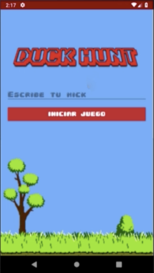
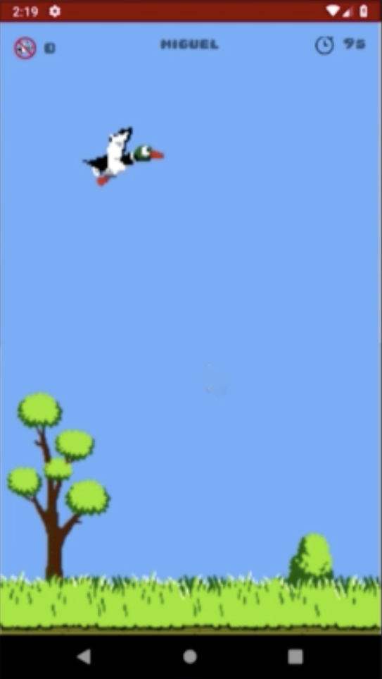
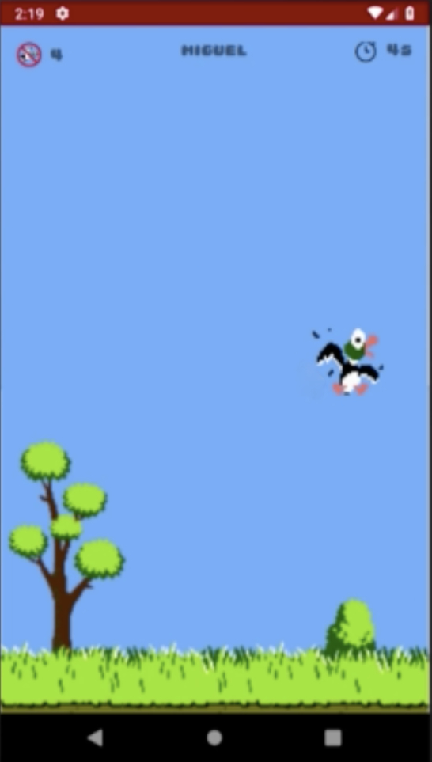
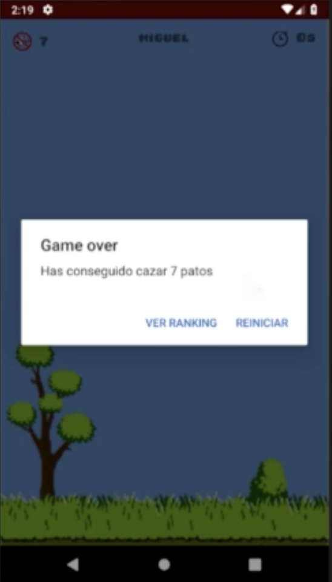

# DuckHunt 

DuckHunt es una aplicación desarrollada durante el curso "To-Do App & Clean Architecture -Android Development - Kotlin " impartido en la plataforma Online Udemy, donde he aplicado mis conocimientos de Android y mejorado mis aptitudes utilizando nuevas herramientas o nuevas metodologías.

Puedes comprobar el curso visitando la URL de Udemy (https://www.udemy.com/course/to-do-app-clean-architecture-android-development-kotlin/) o su página de GitHub (https://github.com/Android-Avanzado/androidgames)

### Capturas de pantalla:

  
  
  
  

